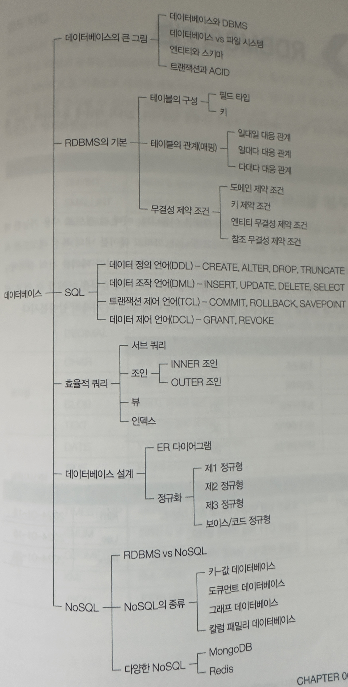

# 데이터베이스의 큰 그림
## 데이터베이스와 DBMS
- 데이터베이스: 원하는 기능을 동작시키기 위해 마땅히 저장해야 하는 정보의 집합
- DBMS(DataBase Management System): 데이터베이스를 생성, 관리, 활용할 수 있도록 도와주는 소프트웨어 시스템
### DBMS의 종류
- 관계형 DBMS(RDBMS): 데이터를 표(테이블) 형태로 저장하고, SQL을 사용하여 데이터를 관리
- NoSQL DBMS: 비관계형 데이터베이스로, 다양한 데이터 모델(문서, 그래프, 키-값 쌍 등)을 지원
### 서버로서의 DBMS
- DBMS는 일반적으로 서버로 동작하며, 클라이언트 애플리케이션이 네트워크를 통해 DBMS에 접속하여 데이터베이스를 조작
- DBMS 클라이언트는 쿼리를 보내고, DBMS는 쿼리를 처리하여 결과를 반환
  - 쿼리는 SQL과 같은 데이터베이스 언어로 작성
- SQL의 분류
  - DDL(Data Definition Language)

    |명령|설명|
    |---|---|
    |CREATE|데이터베이스 객체(테이블, 뷰 등)를 생성|
    |ALTER|데이터베이스 객체의 구조를 변경|
    |DROP|데이터베이스 객체를 삭제|
    |TRUNCATE|테이블의 모든 데이터를 삭제|

  - DML(Data Manipulation Language)
  
    |명령|설명|
    |---|---|
    |SELECT|데이터를 조회|
    |INSERT|데이터를 삽입|
    |UPDATE|데이터를 수정|
    |DELETE|데이터를 삭제|
  
  - DCL(Data Control Language)
  
    |명령|설명|
    |---|---|
    |COMMIT|트랜잭션의 변경 내용을 영구적으로 저장|
    |ROLLBACK|트랜잭션의 변경 내용을 취소|
    |SAVEPOINT|트랜잭션 내에서 특정 지점을 설정|

  - TCL(Transaction Control Language)
    
    |명령|설명|
    |---|---|
    |GRANT|사용자에게 권한 부여|
    |REVOKE|사용자의 권한 회수|

## 파일 대신 데이터베이스를 사용하는 이유
- 파일을 사용했을 경우의 단점
  1. 데이터 일관성 및 무결성 제공이 어려움
  2. 불필요한 중복 저장이 많아짐
  3. 데이터 변경 시 연관 데이터 변경이 어려움
  4. 정교한 검색이 어려움
  5. 백업 및 복구가 어려움
## 데이터베이스의 저장 단위와 트랜잭션

### 데이터베이스의 저장 단위
- 엔티티: 독립적으로 존재할 수 있는 객체로, 데이터베이스에서 저장 및 관리되는 데이터 단위
- 속성: 엔티티의 특성으로, 엔티티가 가지고 있는 데이터를 설명하는 필드
- 도메인: 엔티티의 속성이 가질 수 있는 값의 범위
  
- 릴레이션: 이차원 테이블 형태로 데이터를 저장하는 엔티티의 집합
- 컬렉션: MongoDB에서 데이터를 저장하는 단위로, 엔티티 집합을 표현하는 단위
- 레코드: 데이터베이스에 저장된 엔티티의 인스턴스로, 하나의 행에 해당
- 필드: 엔티티 속성을 표현하는 열로, 하나의 데이터 요소를 나타냄
- 도큐먼트: MongoDB에서 개별 레코드를 JSON 형태로 저장하는 단위
- 카디널리티: 한 필드에 대한 고유 값의 수로, 데이터베이스에서 중복되지 않는 레코드의 개수

### 스키마
- 스키마: 데이터베이스에 저장되는 데이터의 구조와 제약 조건을 정의하는 구조 (SQL)
- 스키마리스 데이터베이스: 고정된 스키마 없이 데이터를 저장하여 유연성을 제공 (NoSQL)
### 트랜잭션과 ACID
- 트랜잭션: 데이터베이스에서 수행되는 작업의 논리적 단위로, ACID 속성을 가짐
- 초당 트랜잭션: 데이터베이스의 성능을 나타내는 지표로, 1초당 처리할 수 있는 트랜잭션의 수
- ACID 속성
  - Atomicity(원자성): 트랜잭션 내의 모든 작업이 완전히 수행되거나 전혀 수행되지 않아야 함
  - Consistency(일관성): 트랜잭션이 완료된 후에도 데이터베이스가 일관된 상태를 유지해야 함
  - Isolation(고립성): 동시에 실행되는 트랜잭션이 서로 간섭하지 않아야 함
  - Durability(지속성): 트랜잭션이 성공적으로 완료되면 그 결과가 영구적으로 저장되어야 함
## 데이터베이스 지도 그리기

# 참고자료
- https://csnote.net/